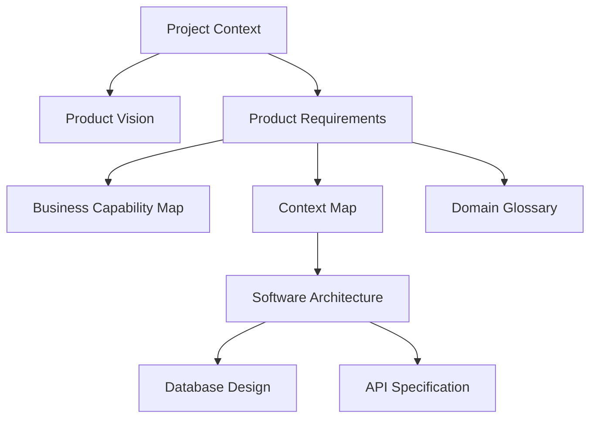

# Project Context

| Property | Value |
|----------|-------|
| Document ID | GOV-002 |
| Title | Project Context |
| Version | 1.0 |
| Status | Draft |
| Owner | Architecture Team |
| Classification | Governance |
| Repository | Fitness Platform Documentation |
| Source of Truth | Yes |
| Review Cycle | On Major Business Change |
| Language | English |
| Last Updated | 2026-07-16 |

---

# 1. Purpose

## 1.1 Objective

This document defines the stable business context of the Fitness Platform project.

It establishes a common understanding of the project's identity, business scope, stakeholders, user groups, business domains, and governing principles.

The primary objective of this document is to capture knowledge that is expected to remain stable throughout the lifetime of the project.

This document intentionally focuses on **business knowledge rather than implementation details**.

Technology choices, architectural decisions, infrastructure, APIs, databases, and implementation strategies are documented separately.

This document serves as the highest-level business reference for all downstream documentation.

---

## 1.2 Guiding Principle

The Fitness Platform is designed around **stable business knowledge**.

Documentation contained in this document changes only when the business itself changes.

Implementation details, technologies, architectural patterns, and operational decisions belong to dedicated documentation and must never be introduced into this document.

---

## 1.3 Scope

### In Scope

This document defines:

- Project identity
- Business context
- Business scope
- Stakeholders
- User groups
- Core business domains
- Governing business principles
- Business constraints
- Long-term project direction

### Out of Scope

This document does not define:

- Software architecture
- Technology stack
- Database design
- API specifications
- User interface design
- Infrastructure
- Deployment
- Security implementation
- Development workflow

These subjects are documented independently within the repository.

---

# 2. Project Overview

## 2.1 Project Name

**Fitness Platform**

---

## 2.2 Project Statement

The Fitness Platform is a domain-driven digital health platform that enables structured health improvement through educational content, personalized programs, professional guidance, and measurable progress.

The platform integrates learning, coaching, health tracking, and professional services into a unified ecosystem designed to support users throughout their long-term health journey.

Rather than functioning as a standalone video application or workout tracker, the platform provides an integrated environment where education, guidance, and measurable outcomes work together.

---

## 2.3 Business Context

Today's digital fitness ecosystem is highly fragmented.

Users typically rely on disconnected resources such as social media, online videos, mobile applications, personal trainers, and nutrition professionals.

These disconnected experiences often result in:

- Inconsistent educational quality
- Lack of structured learning
- Limited personalization
- Poor long-term engagement
- Fragmented progress tracking
- Difficult access to qualified professionals

The Fitness Platform addresses these challenges by providing a unified ecosystem where education, personalized programs, professional guidance, and measurable progress are delivered through a consistent user experience.

---

## 2.4 Project Goals

### Business Goals

- Deliver measurable value through digital health services.
- Build long-term user engagement.
- Enable sustainable subscription-based growth.
- Support collaboration between users and professionals.

### Product Goals

- Provide structured learning experiences.
- Enable personalized health improvement.
- Simplify communication with professionals.
- Deliver measurable user progress.
- Create a scalable product foundation for future capabilities.

### Technical Goals

- Maintain clear separation between business and technology.
- Preserve modular architecture.
- Support long-term maintainability.
- Enable continuous evolution without major redesign.

---

# 3. Business Scope

The Fitness Platform focuses on delivering digital health and fitness services through structured educational experiences, personalized programs, measurable progress tracking, and professional support.

The initial business scope includes:

- Educational content
- Learning experiences
- Fitness programs
- Nutrition programs
- Progress tracking
- Goal management
- Professional services
- Subscription management
- Administrative management

Capabilities outside the current business mission, including social networking, e-commerce marketplaces, or unrelated lifestyle services, are intentionally excluded unless justified by future business requirements.

---

# 4. Stakeholders

The project involves multiple stakeholders, each with clearly defined responsibilities.

| Stakeholder | Primary Responsibility |
|-------------|------------------------|
| Product Owner | Defines business vision, priorities, and product direction. |
| Business Team | Defines business rules and operational processes. |
| Architecture Team | Defines software architecture and technical governance. |
| Development Team | Implements approved specifications. |
| Content Team | Produces and maintains educational content. |
| Professional Team | Provides coaching and professional health services. |
| Customer Support | Assists users and resolves operational issues. |
| Platform Administrators | Operate and manage the platform. |
| Platform Users | Consume platform services and provide business feedback. |

Documentation is considered the authoritative source of project knowledge for every stakeholder.

---

# 5. User Groups

The platform supports multiple categories of users.

---

## 5.1 Platform User

Platform Users are individuals seeking structured improvement of their health and fitness.

Typical activities include:

- Exploring educational content
- Enrolling in learning programs
- Completing learning collections
- Following fitness programs
- Following nutrition programs
- Tracking personal progress
- Managing personal goals
- Receiving professional guidance

---

## 5.2 Professional User

Professional Users provide specialized health services within the platform.

Current professional roles include:

- Fitness Trainer
- Nutritionist

Future professional roles may include:

- Physiotherapist
- Sports Psychologist
- Medical Consultant
- AI Coach

Professional Users interact only with users assigned through the platform's business workflows.

---

## 5.3 Administrative User

Administrative Users are responsible for operating and governing the platform.

Typical responsibilities include:

- User administration
- Professional administration
- Content moderation
- Subscription management
- Platform configuration
- Operational monitoring
- Business reporting
- System governance

Administrative permissions are controlled through authorization policies defined in dedicated security documentation.

# 6. Core Business Domains

The Fitness Platform is organized around a set of well-defined business domains.

Each domain owns its business rules, business data, and responsibilities.

The platform follows Domain-Driven Design (DDD), where each domain has a clear purpose, explicit ownership, and well-defined boundaries.

Business capabilities may span multiple domains, but business rules always belong to a single owning domain.

---

## 6.1 Domain Classification

Business domains are classified into three categories:

- Core Domains
- Supporting Domains
- Generic Domains

---

## 6.2 Core Domains

Core Domains represent the primary business value of the platform.

These domains define the platform's competitive advantage and contain the most important business knowledge.

| Domain | Primary Responsibility |
|----------|------------------------|
| Content | Manages educational assets and learning resources. |
| Program | Manages structured health improvement programs. |
| Progress | Records measurable user achievements and health history. |
| Professional Care | Manages professional guidance and user-care relationships. |

---

### Content

The Content domain owns every educational resource published by the platform.

Examples include:

- Videos
- Courses
- Collections
- Playlists

Future content types may include:

- Articles
- Audio lessons
- Live sessions
- Interactive learning materials

The Content domain owns content creation, organization, publishing, and lifecycle management.

It does not own user progress.

---

### Program

The Program domain organizes structured user journeys.

Programs define how users achieve measurable outcomes through guided activities.

Examples include:

- Fitness Programs
- Nutrition Programs
- Learning Programs
- Challenge Programs

Future program categories may include:

- Rehabilitation Programs
- Mental Wellness Programs
- Sleep Improvement Programs

Programs consume educational content but remain independent from the Content domain.

---

### Progress

The Progress domain records measurable user outcomes throughout their health journey.

Examples include:

- Learning progress
- Program completion
- Body measurements
- Goal achievement
- Workout history
- Nutrition history
- Personal records

Progress is always owned by the individual user.

No business logic outside the Progress domain may directly modify user achievements.

---

### Professional Care

The Professional Care domain manages relationships between users and healthcare professionals.

Current professional roles include:

- Fitness Trainer
- Nutritionist

Future roles may include:

- Physiotherapist
- Sports Psychologist
- Medical Consultant
- AI Coach

Responsibilities include:

- Professional assignment
- Consultation
- Follow-up
- Progress review
- Personalized guidance

Professional Care owns professional-user relationships but does not own educational content or user progress.

---

## 6.3 Supporting Domains

Supporting Domains enable the core business but do not represent the platform's primary competitive advantage.

| Domain | Responsibility |
|----------|----------------|
| Subscription | Controls access to content and platform capabilities. |
| Notification | Delivers user communications. |
| Analytics | Produces operational and business insights. |

---

### Subscription

Subscription determines which capabilities are available to each user.

Examples include:

- Membership validation
- Premium access
- Feature availability
- Program availability
- Content availability

Payment processing is intentionally outside the ownership of this domain.

---

### Notification

Notification provides communication channels for the platform.

Supported channels may include:

- Push Notifications
- Email
- In-App Notifications

Future channels may include:

- SMS
- Messaging Platforms

Notification never owns business decisions.

It only delivers approved communications.

---

### Analytics

Analytics transforms platform events into business insights.

Typical outputs include:

- User engagement reports
- Learning analytics
- Program effectiveness
- Subscription reports
- Professional activity reports

Analytics consumes business events but never becomes the source of business truth.

---

## 6.4 Generic Domains

Generic Domains provide shared technical capabilities used throughout the platform.

These domains contain minimal business knowledge.

| Domain | Responsibility |
|----------|----------------|
| Identity | Authentication and authorization. |
| File Storage | Digital asset storage. |
| Logging | Technical event recording. |
| Audit | Business activity history. |

Generic Domains support the platform without influencing business rules.

---

# 7. Core Business Principles

The following principles guide every business decision.

---

## Principle 1

Documentation is the single source of truth.

---

## Principle 2

Business requirements always drive architecture.

---

## Principle 3

Every business capability has a clearly defined owner.

---

## Principle 4

Programs create structured user journeys.

Educational content supports programs rather than replacing them.

---

## Principle 5

User progress belongs exclusively to the user.

---

## Principle 6

Professional guidance is delivered through managed relationships.

---

## Principle 7

Subscriptions determine platform access.

---

## Principle 8

Business domains own their own business rules and business data.

Cross-domain collaboration occurs only through defined interfaces.

---

## Principle 9

Business logic must exist in only one place.

Duplication of business rules is prohibited.

---

## Principle 10

Every meaningful business activity must be measurable and traceable.

Traceability enables auditing, analytics, personalization, and future AI capabilities.

---

# 8. Business Constraints

The project adopts the following long-term business constraints:

- Keep the MVP focused.
- Prefer simplicity over unnecessary flexibility.
- Preserve clear domain ownership.
- Minimize coupling between domains.
- Design for incremental evolution.
- Avoid introducing new domains without clear business justification.
- Every new capability must have an explicit business owner.
# 9. Project Ecosystem

The Fitness Platform operates within a broader digital health ecosystem.

It is designed to connect users, healthcare professionals, educational resources, and supporting digital services through clearly defined business boundaries.

The platform delivers an integrated experience while allowing individual business capabilities to evolve independently.

---

## 9.1 Internal Ecosystem

The internal ecosystem consists of the following primary participants:

| Participant | Responsibility |
|-------------|----------------|
| Platform Users | Consume programs, educational content, and professional services. |
| Professional Users | Provide coaching, guidance, and health-related services. |
| Platform Administrators | Govern platform operations and business processes. |
| Content Team | Creates and maintains educational resources. |
| Business Operations | Defines policies, workflows, and business rules. |

Each participant contributes to a unified platform experience while maintaining clearly defined responsibilities.

---

## 9.2 External Ecosystem

The platform may integrate with external systems that provide supporting capabilities.

Examples include:

- Payment providers
- Authentication providers
- Notification providers
- Cloud media delivery services
- Analytics platforms
- Wearable device providers
- Third-party health platforms

External systems are considered replaceable infrastructure and must not define or influence the platform's business rules.

Business knowledge always remains inside the platform.

---

# 10. Governance Principles

The project is governed by a set of long-term principles that ensure consistency across business, product, architecture, and implementation.

These principles are expected to remain stable throughout the lifetime of the platform.

---

## Documentation First

Approved documentation is the authoritative source of project knowledge.

Implementation must follow approved documentation.

---

## Business-Driven Decision Making

Business objectives determine product direction and architectural decisions.

Technology exists to support business goals—not to define them.

---

## Explicit Ownership

Every business capability, domain, document, and major decision must have a clearly identified owner.

Clear ownership improves accountability and reduces ambiguity.

---

## Incremental Evolution

The platform evolves through controlled, incremental improvements.

Large-scale redesigns should be avoided unless driven by fundamental business change.

---

## Controlled Complexity

Complexity should be introduced only when it delivers measurable business value.

Premature optimization and unnecessary abstraction are discouraged.

---

## Traceable Decisions

Significant business and architectural decisions must be documented and versioned.

Decision history should remain accessible for future reference.

---

# 11. Success Criteria

The long-term success of the platform is evaluated across four dimensions.

---

## Business Success

The platform successfully delivers sustainable business value by:

- Supporting long-term customer relationships.
- Enabling scalable subscription-based services.
- Delivering measurable value through professional guidance.
- Establishing a trusted digital health ecosystem.

---

## Product Success

The platform enables users to:

- Learn through structured educational experiences.
- Follow personalized health programs.
- Monitor measurable progress.
- Achieve meaningful long-term health improvements.

---

## Technical Success

The platform remains:

- Maintainable
- Modular
- Scalable
- Well-documented
- Adaptable to future business needs

Technical success is measured by the platform's ability to evolve without major architectural redesign.

---

## Documentation Success

Project documentation remains:

- Accurate
- Current
- Consistent
- Traceable
- AI-readable
- Technology-independent where appropriate

Documentation should always reflect the current approved understanding of the business and the system.

---

# 12. Strategic Direction

The Fitness Platform is designed as a long-term digital health platform.

The initial product scope focuses on fitness and nutrition, while the underlying business model is intentionally designed to support future expansion into adjacent health domains.

Potential future business areas include:

- Rehabilitation
- Preventive health
- Mental wellness
- Sleep improvement
- Chronic condition support
- AI-assisted health coaching
- Connected health devices

Future capabilities should extend existing business domains whenever possible.

New business domains should only be introduced when justified by clear business requirements.

Strategic expansion must preserve the platform's core principles, domain boundaries, and documentation standards.

# 13. Repository Context

This document is part of the official Fitness Platform documentation repository.

It provides the highest-level business context and serves as the foundation for all downstream documentation.

No downstream document may contradict the stable business knowledge defined in this document.

---

## 13.1 Document Relationships

This document directly influences the following documents:

| Document | Relationship |
|----------|--------------|
| Product Vision | Defines product direction based on business context. |
| Product Requirements Document | Defines functional and non-functional requirements. |
| Business Capability Map | Identifies business capabilities. |
| Context Map | Defines domain boundaries and relationships. |
| Domain Glossary | Defines shared business terminology. |
| Domain Model | Defines business entities and aggregates. |
| Software Architecture | Defines technical realization of business concepts. |
| Database Design | Implements persistent business models. |
| API Specification | Exposes business capabilities through interfaces. |

Changes to this document may require updates to one or more downstream documents.

---

# 14. References

## Governance Documents

- GOV-001 — AI Manifest
- GOV-003 — Document Registry
- GOV-004 — Documentation Standards

## Product Documents

- PROD-001 — Product Vision
- PROD-002 — Product Requirements Document

## Business Documents

- BUS-001 — Business Capability Map
- BUS-002 — Context Map
- BUS-003 — Domain Glossary
- BUS-004 — Business Rules

---

# 15. AI Consumption Guidelines

This repository is designed for both human readers and AI-assisted development tools.

AI systems consuming this document shall treat it as the authoritative description of the project's stable business context.

---

## Stable Knowledge

This document contains stable business knowledge.

AI tools must not introduce implementation assumptions that are not explicitly documented.

---

## Technology Independence

Technology choices, programming languages, frameworks, infrastructure, and deployment models are intentionally excluded.

AI assistants must obtain those details from architecture documentation.

---

## Business Integrity

Business terminology defined by the Domain Glossary must remain consistent across generated artifacts.

AI systems must avoid introducing alternative terminology unless explicitly approved.

---

## Traceability

Generated artifacts should preserve traceability back to the originating documentation whenever possible.

Business concepts should never lose their documented ownership.

---

## Documentation Hierarchy

When conflicts occur between documents, precedence is determined by the following hierarchy:

1. Governance
2. Product
3. Business
4. Architecture
5. Data
6. API
7. Development

Lower-level documents must never redefine higher-level business knowledge.

---

# 16. AI Metadata

```yaml
document:
  id: GOV-002
  title: Project Context
  version: 1.0
  status: Approved
  classification: Governance

repository:
  name: Fitness Platform Documentation

owner:
  team: Architecture Team

source_of_truth: true

review_cycle:
  trigger: Major Business Change

depends_on:
  - GOV-001

influences:
  - PROD-001
  - PROD-002
  - BUS-001
  - BUS-002
  - BUS-003
  - BUS-004
  - ARCH-001
  - DATA-001
  - API-001

core_domains:
  - Content
  - Program
  - Progress
  - Professional Care

keywords:
  - Fitness
  - Digital Health
  - Program
  - Learning
  - Progress
  - Professional
  - Documentation
  - DDD
```

---

# 17. Knowledge Graph



---

# 18. Change History

| Version | Date | Author | Description |
|----------|------------|-------------------|--------------------------------|
| 1.0 | 2026-07-16 | Architecture Team | Initial approved release. |

---

# 19. Approval

| Role | Status |
|------|--------|
| Product Owner | Pending |
| Business Owner | Pending |
| Chief Architect | Approved |
| Repository Maintainer | Pending |

The document becomes the official source of truth after all required approvals are completed.
